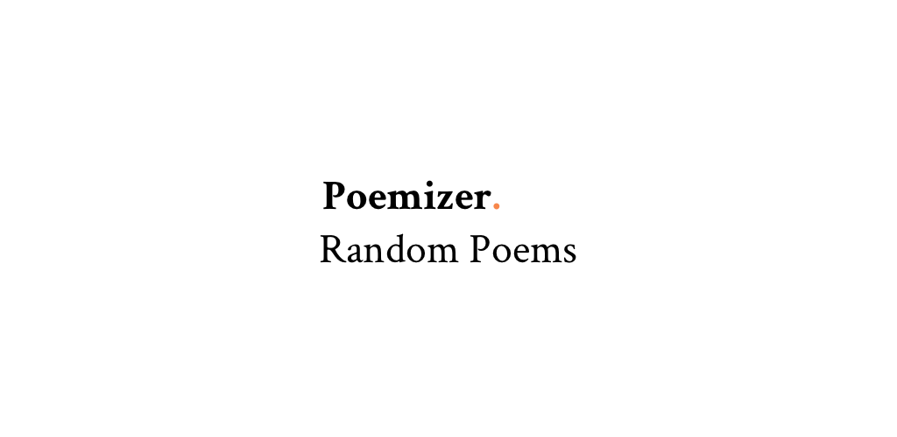

# README

Poemizer is a minimalistic react-native app to get random poems.


## Screenshots
The only screen: <br>


## How to run

Use expo to run the project

```bash
expo start
```

## Contributing
Pull requests are welcome. For major changes, please open an issue first to discuss what you would like to change.

### TODO list
* Ejecting the app to react-native

## License
[MIT](https://choosealicense.com/licenses/mit/)